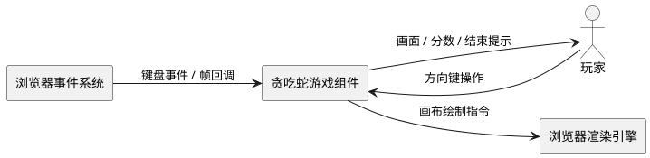
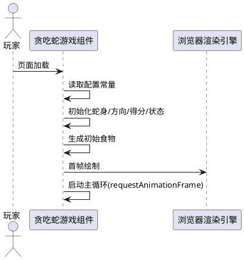
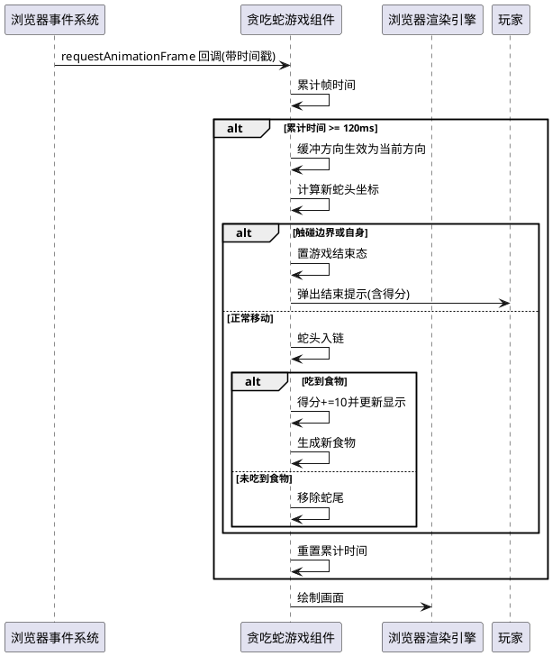
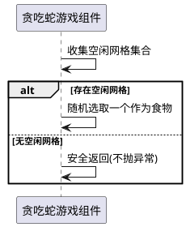
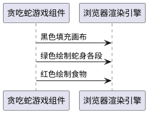
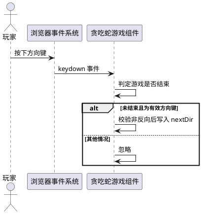
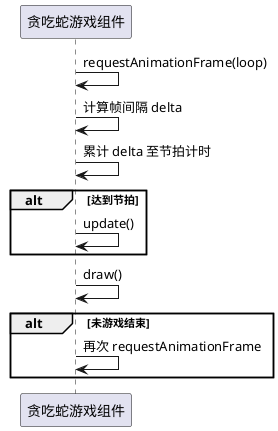

# **1. 组件定位**

## **1.1 核心职责**
本组件负责 [渲染并驱动] [贪吃蛇游戏循环]，实现 [键盘控制蛇身移动、吃食增长、碰撞判定与得分展示的核心游戏体验]。

## **1.2 核心输入**
1. 玩家的键盘方向键操作指令（上、下、左、右箭头键），用于改变蛇身下一帧的移动方向。
2. 浏览器页面加载完成信号，用于触发游戏初始化与主循环启动。
3. 浏览器帧刷新信号（requestAnimationFrame 回调），用于驱动游戏状态更新与画面重绘。

## **1.3 核心输出**
1. 在画布上渲染的游戏画面，包含蛇身、食物、背景。
2. 在页面分数区域实时更新的当前得分数值。
3. 游戏结束时弹出的提示信息，包含最终得分。

## **1.4 职责边界**
1. 本组件不负责游戏难度等级切换、暂停/恢复、音效、排行榜等扩展玩法。
2. 本组件不负责网络通信、数据持久化与多用户联机。
3. 本组件不负责画布尺寸自适应、移动端触屏手势适配。
4. 本组件不负责游戏配置的可视化设置面板，所有配置以常量形式集中管理。

# **2. 领域术语**

**蛇身（Snake）**
: 由有序坐标段组成的链表结构，链首为蛇头，链尾为蛇尾，每段占据一个网格单元。

**食物（Food）**
: 在游戏区域内随机生成、不被蛇身占据的单一网格坐标，被蛇头触碰时触发得分与蛇身增长。

**方向（Direction）**
: 由水平分量 x 与垂直分量 y 组成的单位向量，取值限定为 (1,0)、(-1,0)、(0,1)、(0,-1) 四种。
: 备注：nextDir 为缓冲方向，在下一帧更新时生效，用于防止同帧反向自杀。

**网格（Grid）**
: 将画布按 gridSize 等分形成的二维坐标体系，蛇身与食物均以网格坐标表示。
: 备注：gridSize 为每格像素边长，w、h 为水平与垂直方向的格数。

**游戏结束（GameOver）**
: 蛇头触碰画布边界或自身身体段时进入的终态，触发终止提示并停止状态更新。

**得分（Score）**
: 累计的食物吞噬次数乘以单次得分单位（10 分）的结果值。

# **3. 角色与边界**

## **3.1 核心角色**
玩家：通过键盘方向键操作蛇身移动方向，观察画面与得分，接收游戏结束提示。

## **3.2 外部系统**
浏览器渲染引擎：接收画布绘制指令并呈现游戏画面。
浏览器事件系统：向组件分发键盘按键事件与帧刷新回调。

## **3.3 交互上下文**

# **4. DFX约束**

## **4.1 性能**
1. 游戏主循环单帧处理耗时必须低于 16 毫秒，保证 60fps 流畅渲染。
2. 蛇身移动节拍必须保持在每 120 毫秒一格（与原实现一致），通过帧时间累计控制，不引入节拍漂移。
3. 食物生成必须为 O(n) 确定性算法（n 为蛇身长度），禁止使用递归生成以避免栈溢出风险。

## **4.2 可靠性**
1. 当蛇身占满全部网格时，食物生成必须安全终止而不抛出异常或进入死循环。
2. 游戏在任意可玩状态下刷新页面必须能重新进入初始可玩状态，不残留脏数据。
3. 方向输入必须经过缓冲校验，禁止同帧内出现 180 度反向导致瞬间自杀。

## **4.3 安全性**
1. 组件运行于浏览器前端沙箱，不涉及用户敏感数据，无额外加密要求。
2. 所有外部输入仅限键盘事件 key 值，必须对非方向键输入做忽略处理。

## **4.4 可维护性**
1. 游戏配置常量（网格大小、画布尺寸、移动间隔、得分单位、颜色等）必须集中于一处统一管理，禁止散落字面量。
2. 代码必须按职责模块化拆分（如配置、状态、渲染、输入、循环），模块间通过显式接口交互，禁止全局变量跨模块共享。
3. 关键状态变更与异常分支必须具备可读的命名与结构，便于后续扩展。

## **4.5 兼容性**
1. 重构后对外可见的游戏行为（玩法、得分规则、结束条件、控制方式、画面表现）必须与原始实现完全一致。
2. 组件仅依赖浏览器原生 API（Canvas 2D、requestAnimationFrame、KeyboardEvent），不引入第三方库。

# **5. 核心能力**

## **5.1 游戏初始化**

### **5.1.1 业务规则**
1. **初始蛇身规则**：游戏启动时蛇身必须为单一头段，位于网格坐标 (5,5)。
   a. 验收条件：[页面加载完成] → [蛇身仅含一段且坐标为 (5,5)]
2. **初始方向规则**：游戏启动时蛇身移动方向必须为水平向右 (1,0)。
   a. 验收条件：[页面加载完成后首帧移动] → [蛇头向右移动一格]
3. **初始得分规则**：游戏启动时得分必须为 0 并同步显示于分数区域。
   a. 验收条件：[页面加载完成] → [分数显示为 0]
4. **初始食物规则**：游戏启动时必须生成一个不与蛇身重叠的食物坐标。
   a. 验收条件：[页面加载完成] → [画面存在一个红色食物且不与蛇身重叠]
5. **配置集中规则**：所有可调参数必须从统一配置源读取，禁止在业务逻辑中硬编码。
   a. 验收条件：[审查代码] → [gridSize、画布尺寸、移动间隔、得分单位、颜色等均来自配置模块]

### **5.1.2 交互流程**

### **5.1.3 异常场景**
1. **配置缺失异常**
   a. 触发条件：配置模块未提供必要常量
   b. 系统行为：以默认值兜底并记录警告
   c. 用户感知：游戏仍可正常启动，无可见异常

## **5.2 蛇身移动与状态更新**

### **5.2.1 业务规则**
1. **节拍规则**：蛇身移动必须每 120 毫秒推进一格，通过帧时间累计判定，不受帧率波动影响。
   a. 验收条件：[连续运行 1.2 秒] → [蛇身恰好推进 10 格]
2. **方向缓冲规则**：键盘输入的方向必须先写入缓冲变量 nextDir，在下一节拍生效时才赋值给当前方向 dir。
   a. 验收条件：[同一节拍内连续按下多个方向键] → [仅最后一个有效方向在下一节拍生效]
3. **反向自杀禁止规则**：当待设方向与当前方向呈 180 度反向时，必须忽略该输入。
   a. 验收条件：[蛇向右移动时按下左键] → [方向保持向右不变]
4. **边界碰撞规则**：蛇头移动至画布外（坐标小于 0 或大于等于 w/h）时必须触发游戏结束。
   a. 验收条件：[蛇头触及边界] → [游戏结束并提示得分]
5. **自身碰撞规则**：蛇头坐标与任意身体段坐标重合时必须触发游戏结束。
   a. 验收条件：[蛇头触碰自身] → [游戏结束并提示得分]
6. **正常移动规则**：未碰撞且未吃到食物时，蛇头新增至链首，蛇尾移除，蛇身长度不变。
   a. 验收条件：[普通移动一帧] → [蛇身长度不变且整体前进一格]
7. **游戏结束冻结规则**：游戏结束后主循环必须停止状态更新，不再响应方向输入。
   a. 验收条件：[游戏结束后按键] → [无任何状态变化]

### **5.2.2 交互流程**

### **5.2.3 异常场景**
1. **同帧多次方向输入异常**
   a. 触发条件：单节拍内玩家快速按下多个方向键
   b. 系统行为：仅最后一次有效（非反向）输入写入缓冲方向
   c. 用户感知：蛇身按预期单一方向移动，无抖动
2. **反向键连按异常**
   a. 触发条件：玩家连续按下与当前方向相反的方向键
   b. 系统行为：反向输入被忽略，方向保持不变
   c. 用户感知：蛇身不出现瞬间自杀

## **5.3 食物生成**

### **5.3.1 业务规则**
1. **随机分布规则**：食物坐标必须在 [0,w) × [0,h) 范围内均匀随机生成。
   a. 验收条件：[多次生成食物] → [食物坐标始终位于合法网格内]
2. **不重叠规则**：食物坐标必须不与任意蛇身段重合。
   a. 验收条件：[蛇身任意段坐标] → [均不等于食物坐标]
3. **非递归生成规则**：食物生成必须采用迭代或候选集过滤的确定性算法，禁止递归调用自身。
   a. 验收条件：[审查代码] → [生成函数无递归自调用]
4. **满格安全规则**：当蛇身占满全部网格无法放置食物时，生成流程必须安全返回而不抛出异常或栈溢出。
   a. 验收条件：[蛇身长度等于 w×h] → [生成流程平稳结束，游戏可继续至下次判定]

### **5.3.2 交互流程**

### **5.3.3 异常场景**
1. **蛇身占满画布异常**
   a. 触发条件：蛇身长度达到 w×h，无空闲网格
   b. 系统行为：食物生成安全终止，不递归、不抛错
   c. 用户感知：游戏不崩溃，继续运行至下一帧判定

## **5.4 画面渲染**

### **5.4.1 业务规则**
1. **背景绘制规则**：每帧必须先以黑色填充整个画布作为背景。
   a. 验收条件：[任意帧渲染] → [画布整体先被黑色覆盖]
2. **蛇身绘制规则**：蛇身每段必须以绿色（#44ff88）填充对应网格区域，每格边长为 gridSize-1 像素以保留分隔线。
   a. 验收条件：[渲染蛇身] → [每段呈绿色且格间可见分隔]
3. **食物绘制规则**：食物必须以红色（#ff4444）填充对应网格区域，边长为 gridSize-1 像素。
   a. 验收条件：[渲染食物] → [食物呈红色单格]
4. **渲染独立性规则**：渲染逻辑必须与状态更新逻辑解耦，仅依赖当前状态进行绘制。
   a. 验收条件：[审查代码] → [渲染函数不修改游戏状态]

### **5.4.2 交互流程**

### **5.4.3 异常场景**
1. **画布上下文获取异常**
   a. 触发条件：getContext('2d') 返回 null
   b. 系统行为：终止启动并记录错误
   c. 用户感知：画面不更新，控制台可见错误日志

## **5.5 输入处理**

### **5.5.1 业务规则**
1. **按键映射规则**：仅 ArrowUp、ArrowDown、ArrowLeft、ArrowRight 四键生效，其余按键必须被忽略。
   a. 验收条件：[按下非方向键] → [无任何方向变化]
2. **方向映射规则**：上键对应 (0,-1)、下键对应 (0,1)、左键对应 (-1,0)、右键对应 (1,0)。
   a. 验收条件：[按下各方向键] → [缓冲方向为对应向量]
3. **游戏结束屏蔽规则**：游戏结束后按键事件必须被直接忽略，不再写入缓冲方向。
   a. 验收条件：[游戏结束后按方向键] → [nextDir 不变]
4. **监听绑定规则**：键盘监听必须绑定于 document，且仅绑定一次。
   a. 验收条件：[审查代码] → [单一 keydown 监听器]

### **5.5.2 交互流程**

### **5.5.3 异常场景**
1. **非方向键输入异常**
   a. 触发条件：玩家按下字母键、功能键等
   b. 系统行为：事件被忽略
   c. 用户感知：无方向变化

## **5.6 主循环调度**

### **5.6.1 业务规则**
1. **帧调度规则**：主循环必须使用 requestAnimationFrame 驱动，禁止使用 setTimeout/setInterval 作为循环驱动源。
   a. 验收条件：[审查代码] → [循环由 requestAnimationFrame 递归调用]
2. **节拍解耦规则**：渲染按帧执行，状态更新按 120ms 节拍执行，二者必须解耦。
   a. 验收条件：[帧率波动] → [移动节拍仍稳定为 120ms]
3. **循环终止规则**：游戏结束后必须停止调度新的帧请求，避免无意义计算。
   a. 验收条件：[游戏结束后] → [不再发起 requestAnimationFrame]

### **5.6.2 交互流程**

### **5.6.3 异常场景**
1. **帧时间戳异常**
   a. 触发条件：回调时间戳缺失或异常
   b. 系统行为：以当前时间兜底计算 delta
   c. 用户感知：节拍无明显波动

# **6. 数据约束**

## **6.1 蛇身段（Segment）**
1. **x**：水平网格坐标，整数，取值范围 [0, w-1]。
2. **y**：垂直网格坐标，整数，取值范围 [0, h-1]。
3. **唯一性**：除蛇头外，任意段坐标在蛇身中唯一不重复。

## **6.2 食物（Food）**
1. **x**：水平网格坐标，整数，取值范围 [0, w-1]。
2. **y**：垂直网格坐标，整数，取值范围 [0, h-1]。
3. **不重叠性**：食物坐标必须不与任意蛇身段重合。

## **6.3 方向（Direction）**
1. **x**：水平分量，整数，取值限定 {-1, 0, 1}。
2. **y**：垂直分量，整数，取值限定 {-1, 0, 1}。
3. **单位性**：x 与 y 不能同时非 0，且不能同时为 0，即 |x| + |y| = 1。

## **6.4 游戏状态（GameState）**
1. **score**：当前得分，非负整数，初始为 0，每次吃食 +10。
2. **gameOver**：游戏是否结束，布尔值，初始为 false，触发碰撞后置 true 且不可逆。
3. **snake**：蛇身段有序列表，长度 ≥ 1，链首为蛇头。
4. **dir**：当前生效方向，满足方向约束。
5. **nextDir**：缓冲方向，满足方向约束，下一节拍生效。

## **6.5 配置常量（Config）**
1. **gridSize**：单格像素边长，正整数，原始值为 20。
2. **canvasWidth**：画布宽度像素，正整数，原始值为 400。
3. **canvasHeight**：画布高度像素，正整数，原始值为 400。
4. **moveInterval**：移动节拍毫秒数，正整数，原始值为 120。
5. **scoreUnit**：单次吃食得分，正整数，原始值为 10。
6. **snakeColor**：蛇身颜色，字符串，原始值为 #44ff88。
7. **foodColor**：食物颜色，字符串，原始值为 #ff4444。
8. **bgColor**：背景颜色，字符串，原始值为 #000000。
9. **initialSnake**：初始蛇身坐标，原始值为 [{x:5, y:5}]。
10. **initialDir**：初始方向，原始值为 {x:1, y:0}。